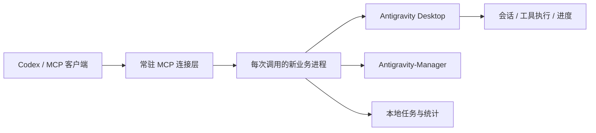

<div align="center">

# agy MCP
### 把 Antigravity 接入你的编码工作流

**明确委派 · 可见进度 · 账号与额度 · 业务热加载**

[](https://github.com/folgercn/agy-mcp/actions/workflows/tests.yml)


[快速开始](#快速开始) · [工具一览](#工具一览) · [运行边界](#运行边界) · [更新记录](CHANGELOG.md)

</div>

---

agy MCP 是一个独立 Python 服务，通过本机 Antigravity Desktop 后端提供任务委派、进度观察、多账号额度查询和安全切号。无需依赖 vnpy 项目，也无需鼠标键盘自动化。

> 当前针对 **macOS / Apple Silicon、Python 3.11+**。使用 Antigravity 内部接口，Desktop 升级可能带来兼容性变化。多账号能力需本机 Antigravity-Manager；请使用自己的登录和凭证。

## 能做什么

| 能力 | 实际行为 |
| :--- | :--- |
| **持续看进度** | `watch` 最多 60 秒返回最近动作与活动摘要，沿同一 job/cursor 继续观察 |
| **追踪后续执行** | 主任务返回后，继续只读观察父会话；子 reviewer 仅在父会话反映其状态时可见 |
| **看清账号额度** | 查询 Gemini / Claude 五小时及周额度、对应重置时间；缺失数据保留未知 |
| **验证后切号** | 先检查任务排空，再核验 Desktop 实际身份与 Gemini 两个额度窗口 |
| **改代码即生效** | 业务模块每次调用加载；正在执行的任务保持原代码，不重派 |
| **减少日志体积** | 轨迹与分页记录摘要，保留动作进度和结果；历史终态任务自动清理 |

## 快速开始

### 1. 安装

先启动并登录 Antigravity Desktop，然后在非 iCloud 同步目录安装：

```sh
git clone git@github.com:folgercn/agy-mcp.git
cd agy-mcp
python3.11 -m venv .venv
.venv/bin/python -m pip install -e '.[test]'
```

### 2. 接入 Codex

将下面配置合并进你的 MCP 配置，替换为本机真实绝对路径：

```toml
[mcp_servers.antigravity]
command = "/absolute/path/agy-mcp/.venv/bin/agy-mcp"
args = ["--transport", "stdio"]
startup_timeout_sec = 20
tool_timeout_sec = 3660
```

首次注册需要让宿主加载 MCP。推荐本机 `stdio`，无需额外网络监听。另支持 SSE 与 Unix socket，详情见 [运行说明](docs/operations.md)。

### 3. 安装可选 Skill

将 `skills/agy-mcp` 和 `skills/antigravity-delegate` 复制到你的 Codex skills 目录。已有同名 Skill 时先比较、备份；不要覆盖个人规则。

明确指定项目和工作块，例如：

> 用 agy MCP，在 `/absolute/path/project` 调查这个问题并完成修复与测试。先检查项目绑定；保持同一任务，持续观察进度，完成后核验真实 diff 和测试结果。

### 4. 验证

```sh
.venv/bin/python -m pytest -q
# 可选：只读检查本机 Desktop；不会提交任务或切换账号
AGY_SMOKE_CWD=/absolute/path/project .venv/bin/python tests/smoke_readonly.py
```

## 工作原理



`submit → job_id → watch → result`：请求有明确身份，观察不等于重派。连接断开后沿原 job/cursor 恢复，不能据此重复提交。

## 工具一览

| 场景 | 工具 |
| :--- | :--- |
| 项目与执行 | `projects` · `submit` · `message` · `cancel` |
| 进度与结果 | `watch` · `status` · `result` · `events` · `wait` |
| 账号与能力 | `list_accounts` · `account_usage` · `switch_account` · `account_leaderboard` · `tool_status` |

账号列表的 `quota` 包含 `gemini_weekly_reset_time`、`gemini_5h_reset_time`、`claude_weekly_reset_time`、`claude_5h_reset_time`。时间沿用 Manager 保存的 ISO 8601 值，`Z` 表示 UTC；不从模型短期重置时间推算周重置时间。

## 运行边界

- **切号会重启 Antigravity**，必须确认任务排空；身份或额度未知时阻止派单。
- **业务更新无需重启**：账号、额度、切号、任务、观察和结果均按调用加载。首次启用此架构，以及工具参数、连接认证、环境或依赖变更仍需相应重载。
- **终态不等于交付**：`REVIEW_REQUIRED`、`TASK_BUSY`、空队列或模型自报成功都不能代替真实改动与验收。
- **历史记录有保留上限**：有结果文件的终态 job 在超过 3 天或排在全部有效 job 最新 5 项之外时会被删除。运行中任务不删；需要审计的记录请提前归档。
- **运行数据不入库**：任务、事件、结果可能包含上下文。凭证、个人状态和备份都应保留在本机。

## 项目结构

```text
agy_mcp/
  server.py       MCP 工具声明与传输
  business.py     每次调用的业务入口
  core/           Desktop、任务、观察与原生额度
  switching.py    切号屏障与原生身份验证
  manager_client.py / quota_reader.py / usage_tracker.py
skills/           可复用委派规则
tests/            单元、协议与热加载测试
docs/             运行与维护说明
```

## 开发与贡献

修改业务代码后运行 `python -m pytest -q`，保持工具契约稳定。PR 请说明行为变化、测试证据和兼容性边界。不要提交账号文件、日志或真实任务记录。

源自 [vnpy-web-bridge PR #580](https://github.com/folgercn/vnpy-web-bridge/pull/580)，现独立维护。本项目不是 Antigravity 或 OpenAI 官方产品。
